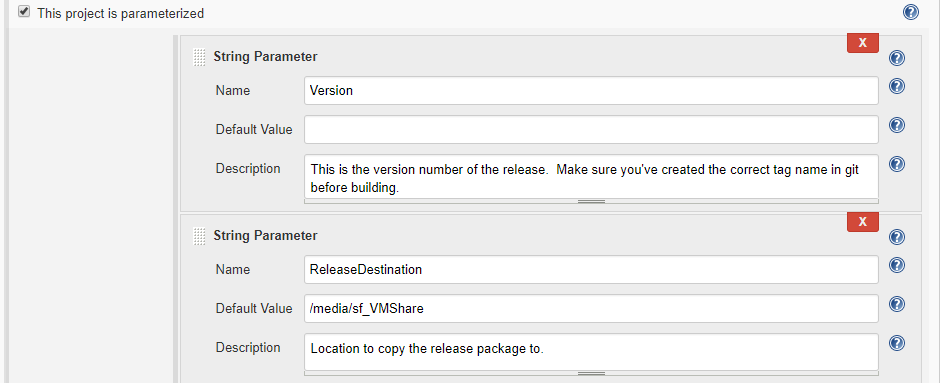

Jenkins Continuous Integration and Automated Release Building
=============================================================

[Continuous integration](https://en.wikipedia.org/wiki/Continuous_integration) is a great way to keep software projects in tip-top shape and avoid surprises by finding something that is failing as early as possible.  

For my own development, I use [Jenkins](https://jenkins.io/) as a build server.  Jenkins allows for easily setting up a continuous integration system as well as an automated release build system.

As shown below, I have various Jenkins projects setup for the PhaseVocoder project.  These include both continuous integration (CI) and release building on Windows, OS X and Linux.

 

**Setting Up Jenkins**

I'm not going to include specific instructions for setting up Jenkins.  Doing a simple search will give you numerous helpful instructions on how to do this.

Currently (Fall 2017), my personal development environment has Jenkins running on my main development machine and uses VMs for Jenkins' build agents.  I have VMs running Windows, Linux (Ubuntu) and OS X (El Capitan).  As soon as a new commit happens to the master branch of the GitHub PhaseVocoder project, the repo is cloned and built on each of these machines.

Part of the awesomeness of this is having my latest changes built with various C++ compilers on various platforms and getting very timely feedback of any issues on these platforms/compilers.  The compilers I'm currently (Fall 2017) using are MS Visual Studio 2017, GCC 5.3.1 and Apple LLVM version 7.3.0 (clang 703.0.31). 

 

**Setting Up Continuous Integration Jenkins Projects**

Once you have Jenkins and your build agents setup, creating a new CI job is easy.  Click "New Item" and give it a name.  Under "Source Code Management" select "Git", set the repo to https://github.com/tmdarwen/PhaseVocoder.git and branch to master as shown below.

As shown below, set the build trigger to poll the source code management system.  The schedule I've specified checks the PhaseVocoder GitHub repo every five minutes.  If it finds a change has occurred since it last checked, it will kick off a new build.

Under the "build" section, simply specify the build script Jenkins should run.  Note that these scripts can be found in the Automation directory of the PhaseVocoder project.

 

**Setting Up Automated Release Projects**

Jenkins is super handy for building releases as well.  I've setup my environment so that with just a single mouse click Jenkins will build a new tag of the project and deliver the binary to a specific location on a shared drive.  Setting this up is very similar to the above instructions on setting up CI projects with the addition of the parameters shown below:

When building the project in Jenkins for a new release you'll simply create a tag in the GitHub project and then enter that tag version in Jenkins as shown below.

The release will be built and the resulting binary is placed on the shared drive in the specified release destination.
